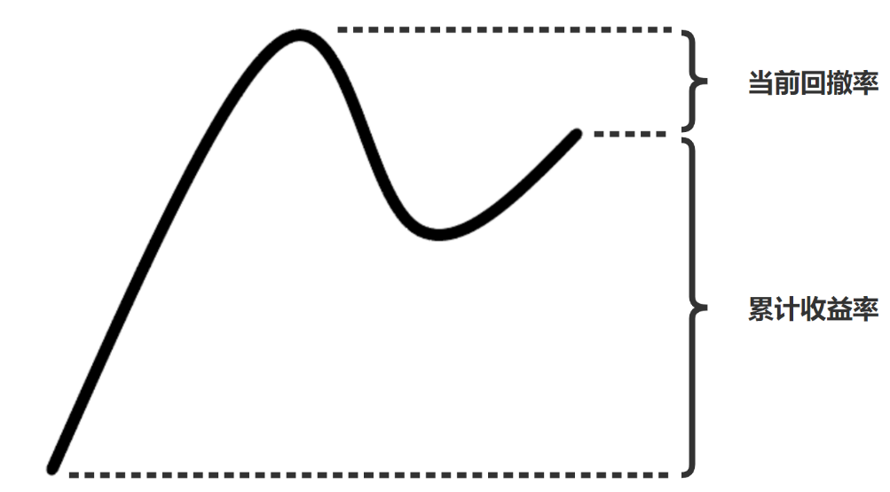

# 强化学习交易股票
在强化学习模型的奖励函数设计中同时引入了流动行风险、下行风险与长期累计奖励的考量，利用近五年A股市场数据，对五个深度强化学习算法进行测试，并与三种传统股票交易策略对比，找到比较合适的深度强化学习智能体

## 回测结果

回测结果展示（时间跨度为2020年1月1日至2022年1月1日）


回测结果分析表（时间跨度为2020年1月1日至2022年1月1日，baseline 为上证50指数）

|                        | Cumulative returns | Max drawdown | Omega ratio | Sharpe ratio | Calmar ratio | Sortino ratio | Annual return | Annual volatility |
|------------------------|--------------------|--------------|-------------|--------------|--------------|---------------|---------------|-------------------|
| 上证50指数             | 6.11%              | -23.81%      | 1.04        | 0.26         | 0.13         | 0.35          | 3.12%         | 18.96%            |
| Equal-weight strategy  | 36.20%             | -19.60%      | 1.14        | 0.79         | 0.89         | 1.1           | 17.40%        | 23.90%            |
| Mean-variance strategy | 20.90%             | -31.30%      | 1.09        | 0.50         | 0.33         | 0.68          | 10.40%        | 27.30%            |
| Min-variance strategy  | 1.10%              | -16.40%      | 1.02        | 0.11         | 0.04         | 0.16          | 0.60%         | 14.40%            |
| A2C                    | 45.72%             | -24.47%      | 1.16        | 0.85         | 0.88         | 1.23          | 21.61%        | 27.47%            |
| DDPG                   | 20.50%             | -20.04%      | 1.10        | 0.57         | 0.51         | 0.8           | 10.17%        | 20.81%            |
| PPO                    | 35.67%             | -22.21%      | 1.13        | 0.71         | 0.77         | 1.02          | 17.18%        | 27.95%            |
| SAC                    | 31.44%             | -24.77%      | 1.12        | 0.66         | 0.62         | 0.93          | 15.26%        | 27.04%            |
| TD3                    | 38.31%             | -23.10%      | 1.15        | 0.78         | 0.79         | 1.09          | 18.36%        | 26.20%            |

更加详细的回测结果可以查看 [./plot_traded_result.ipynb](./plot_traded_result.ipynb)

## 快速开始

在终端中输入

```shell
git clone https://github.com/sunnyswag/RL_in_Stock.git
git pip install -r requirements.txt
```

进入 [./learn](./learn) 文件夹查看详细步骤

## 环境设计思路

**state_space 由三部分组成 :** 

1. 当前的现金

3. 每只股票的持仓量

4. 股票数 * 环境因素（总计15个）


**reward 的计算方式：**

* Reward = 累计收益率 - 当前回撤率

  

**action_space 的空间：**

* actions ∈ [-x, x]

* 正数表示买入，负数表示卖出，0 表示不进行买入卖出操作


## Reference

[FinRL](https://github.com/AI4Finance-LLC/FinRL)
